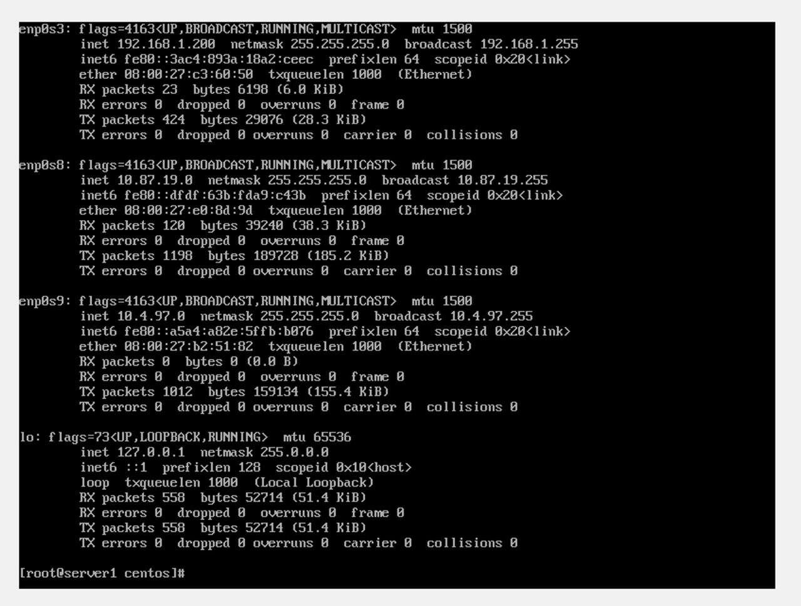
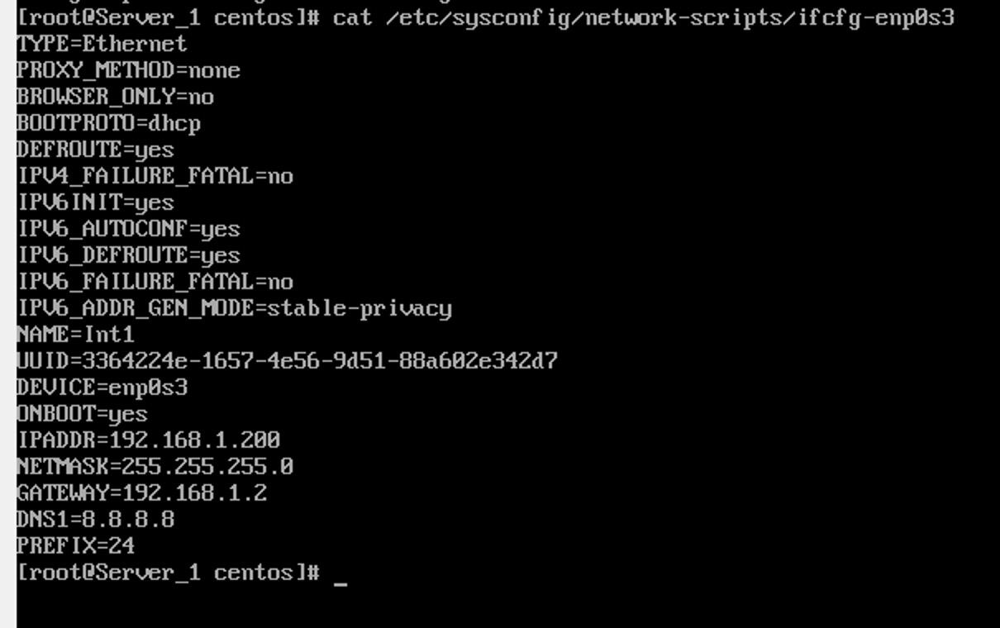
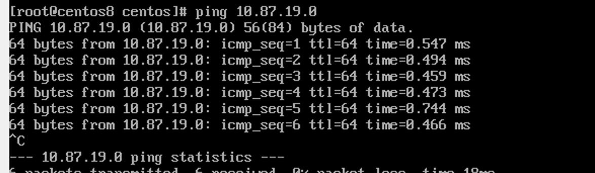
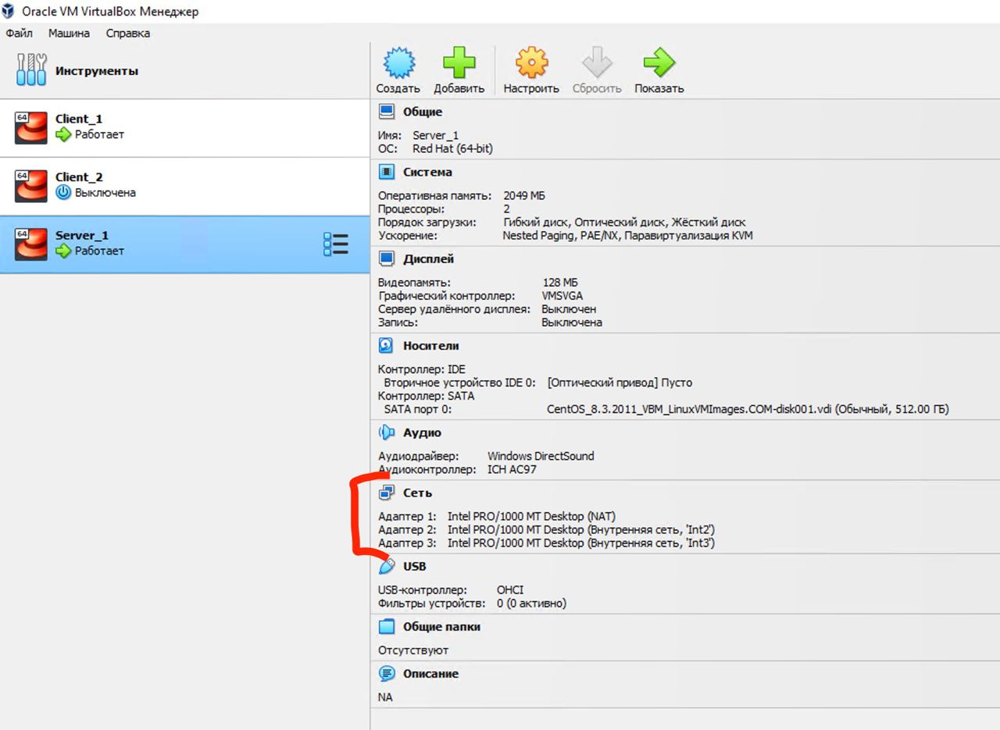

# Part 1 – Configure application

## 1. На Server_1 налаштувати статичні адреси на всіх інтерфейсах.


## 2. На Server_1 налаштувати DHCP сервіс, який буде конфігурувати адреси Int1 Client_1 та Client_2


## 3.  За допомогою команд ping та traceroute перевірити зв'язок між віртуальними машинами. Результат пояснити.
На скриншоте ниже мы видим что мы можем достучаться с одного сервера на другой с помощью команды ping

On the screenshot below we can see that we can connect from one server to another via ping command



## 4. На віртуальному інтерфейсу lo Client_1 призначити дві ІР адреси за таким правилом: 172.17.D+10.1/24 та 172.17.D+20.1/24. Налаштувати маршрутизацію таким чином, щоб трафік з Client_2 до 172.17.D+10.1 проходив через Server_1, а до 172.17.D+20.1 через Net4. Для перевірки використати traceroute.

My IPs: 

Client_1 IPs: 
- 172.17.29.1/24
- 172.17.39.1/24

Client_2 -> Server_1 -> 172.17.29.1
Client_2 ->   Net4   -> 172.17.39.1

```
post-up route add -net 172.17.29.0 netmask 255.255.255.0 gw 10.87.19.0 dev enp0s8

post-up route add -net 172.17.39.0 netmask 255.255.255.0 gw 10.4.87.0 dev enp0s8
```

## 5. Розрахувати спільну адресу та маску (summarizing) адрес 172.17.D+10.1 та 172.17.D+20.1, при чому префікс має бути максимально можливим. Видалити маршрути становлені на попередньому кроці та замінити їх об’єднаним маршрутом, якій має проходити через Server_1.

General IP range is : 

172.17.0.0/16

```
post-up route add -net 172.17.0.0 netmask 255.255.255.0 gw 10.87.19.0 dev enp0s8
```

## 6. Налаштувати SSH сервіс таким чином, щоб Client_1 та Client_2 могли підключатись до Server_1 та один до одного.

You need to run next commands 

```
systemctl enable ssh --now
```

```
 dnf install firewalld
```

- Check if firewalld is running
firewall-cmd --state
running

- If the above command returns 'not running' then you can start the service using:
```
systemctl start firewalld
```
- Get your default zone
```
firewall-cmd --get-default-zone
public
```
- Get the list of interfaces part of your active zone
```
firewall-cmd --get-active-zones
public
  interfaces: enp0s3 enp0s8
```

Next we need Change Network Settings to use “Bridged Adapter”
After that we are checking if IPS configured statickly or DHCP

```
nmcli con show
```

After that we need to restart service 

```
nmcli networking off
nmcli networking on
```

After all this configuration we can do SSH from Clinet_1 to Client_2  and reverse 

## 7. Налаштуйте на Server_1 firewall таким чином:
  • Дозволено підключатись через SSH з Client_1 та заборонено з Client_2
  
  We can add Ip from CLient_1 to this file 
  ```
  vi /etc/hosts.deny 
  ```
  
  For instance we can block 22 port and it will block the ability to connect via SSH or turn off ssh service 
  ```
  systemctl disable ssh
  ```

  • З Client_2 на 172.17.D+10.1 ping проходив, а на 172.17.D+20.1 не проходив
  
  Same as on previous step we can just add Ip range to hosts.deny file and it will resolve our issue
  ```
  vi /etc/hosts.deny 
  ```
## 8. . Якщо в п.3 була налаштована маршрутизація для доступу Client_1 та Client_2 до мережі Інтернет – видалити відповідні записи. На Server_1 налаштувати NAT сервіс таким чином, щоб з Client_1 та Client_2 проходив ping в мережу Інтернет


